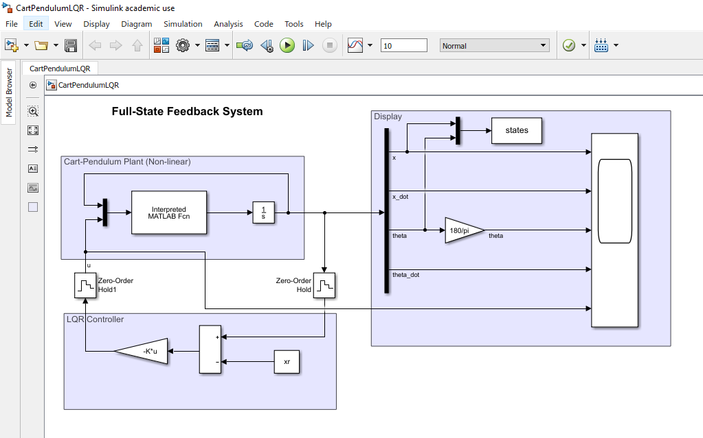

# Linear Quadratic Regulator: #

Here cart pendulum system is controlled using LQR gains.

Mathematical model of cart pendulum is available here:
Theory about the LQR can be found in this PDF.  

**Assumptions and Limitations:**
1. Full-state feedback is available. i.e. measured x, x_dot, theta, theta_dot is available.
2. Measurement noise or plant disturbances are not considered.

## Simulink Model: ##

## Observations: ##

For following observations initial state and reference staes are as follows: (Refer to Initialize.m line 46 and 49) 	

`%initial state`

`x0 = [1; 0; 30*pi/180; 0];`

`%reference state to achieve`

`xr = [1; 0; 0; 0];`

Q | R | Settling time (theta=0) | Settling time (x=xr) | Max input (u) | Max(theta_dot):x4 | Max(x_dot):x2 | Comment
--|---|-------------------------|----------------------|---------------|-------------------|---------------|--------
Q(x1)=1, Q(x3)=1 | 1 | 5 sec | 7 sec | 10.66 N | -1.9 | 1.762 | started with all elements 1
Q(x1)=1, Q(x3)=10 | 1 | 5 sec | 7 sec | 10.66 N | -1.9 | 1.762 | No major changes are observed
Q(x1)=5, Q(x3)=10 | 0.5 | 4 sec | 3 sec | 14.66 N | -2.5 | 1.8 | By reducing the value of R we allowed system to use for input. By increasing the Q(x1) we made system fast enough to get to the reference x faster than previous experimets.
Q(x1)=5, Q(x3)=10 | 1 | 4 sec | 4 sec | 12.3 N | -2.2 | 1.8 | Compare to earlier experiment (i.e. 3rd) the value of R is increased that means we are restricting to use input that's why input is 12 N whereas in 3rd experiment it is 14N. By increasing the Q(x1) compared to experiment 1 and 2, we made system fast enough to get to the reference x faster but it's slower than experiment 3 because of the input restriction.
Q(x1)=50, Q(x3)=100 | 1 | 3 sec | 4 sec | 18.12 N | -3.3 | 2 | In this experiment, we increased Q(x1) and Q(x3) compared to earlier experiment. Difference between state Q(x2,x4) - Q(x1,x3) is larger thatn other experiments. Meaning of this is that we want to achieve these states much faster and there are very less restrictions on state x2, x4. That is why max values of linear acceleration(x_dot) and theta_dot is greater than any of other experiments.

Above table shows impact of Q and R matrix on system performance in terms of maximum input utilized, settling time of different states, maximum rate of change of specific state.
By performing these experimets in simulation we can save lot of time on calibration of the system.
These experiments help to verify your design and hadware component selection.

**Note:** In some paper, it's mentioned that Q=C'C is good value to start. Reason for this is NOT explained. Need further investigation.

You can measure maximum theta which will not make system unstable can be found experimentally for specifc design parameters.
Experimentally, I observed that this system works fine for theta in the range -65 degree to 65 degree. for 	Q = [1,0,0,0;0,1,0,0;0,0,1,0;0,0,0,1];	R = 1;
