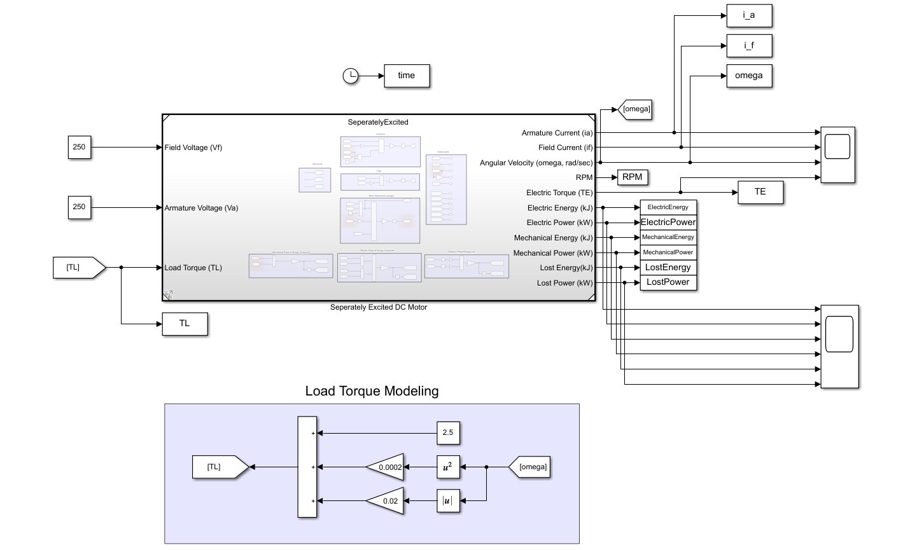
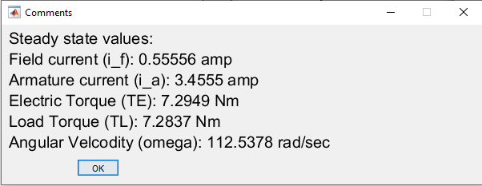
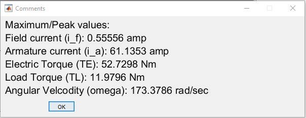

# Seperately Excited DC Motor

## Objective: 

* Simulate an abrupt startup (i.e.both (stator and rotor) windings driven immediately to rated voltage).
* Estimate steady state values of motor for specific (Va, Vf) applied vlotage.
* Lost power/energy anlysis.

## Model/Developement:

## Results:

* **Steady State Values**

* **Max values**

* **Torque**

* **Power**

* **Energy**

## Learnings/Comments/Analysis/Remember:
1. Steadt state analysis performed for Va=250, Vf=250.
2. More energy is consumed in startup phase. Settling time = 0.7 sec. Energy spent during startup: ~ 1015 J.

## Future work:
I tried reducing energy spent for startup of motor in next sections (i.e. [sequential startup](https://github.com/VishalDevnale/ControlSystem/tree/master/ElectricMachines/DC_Motors/01_SeperatelyExcitedDCMotor/02_SequentialStepStart) and [ramp startup](https://github.com/VishalDevnale/ControlSystem/tree/master/ElectricMachines/DC_Motors/01_SeperatelyExcitedDCMotor/03_SequentialRampStart)).
