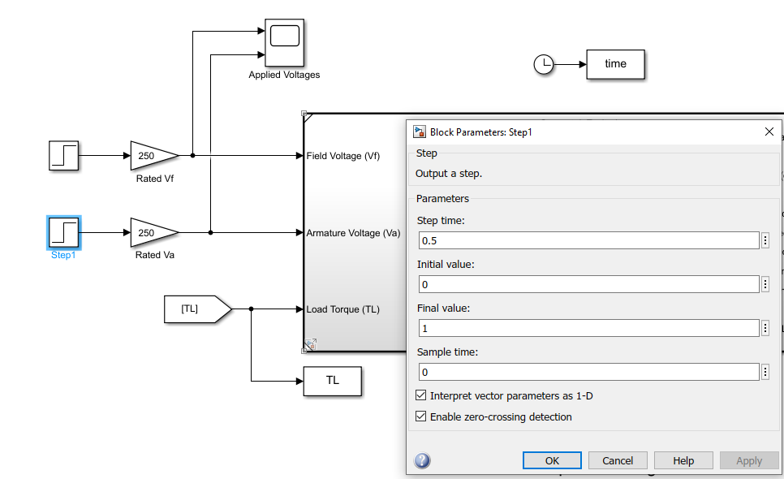
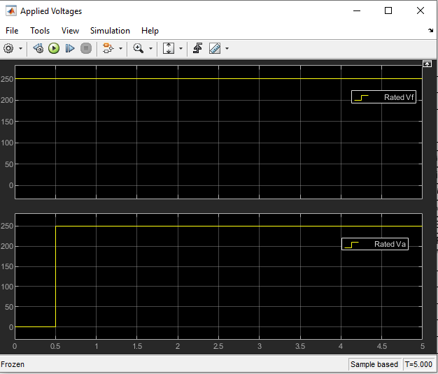
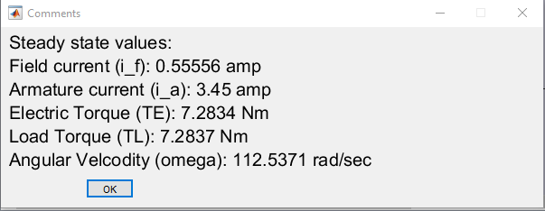
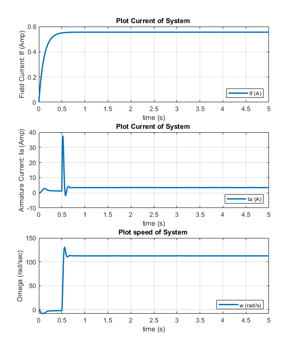
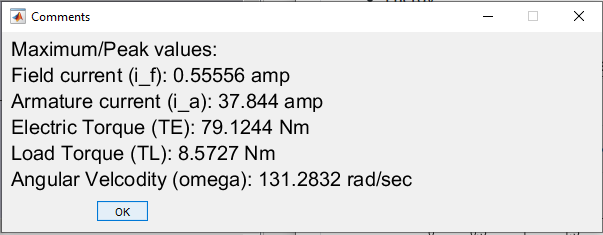
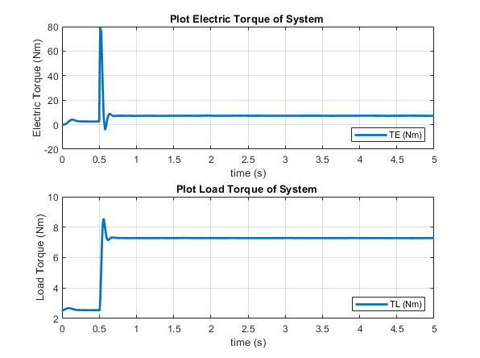
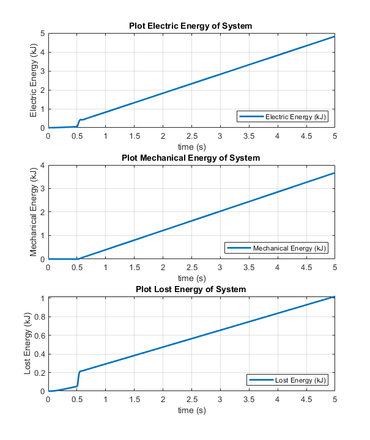
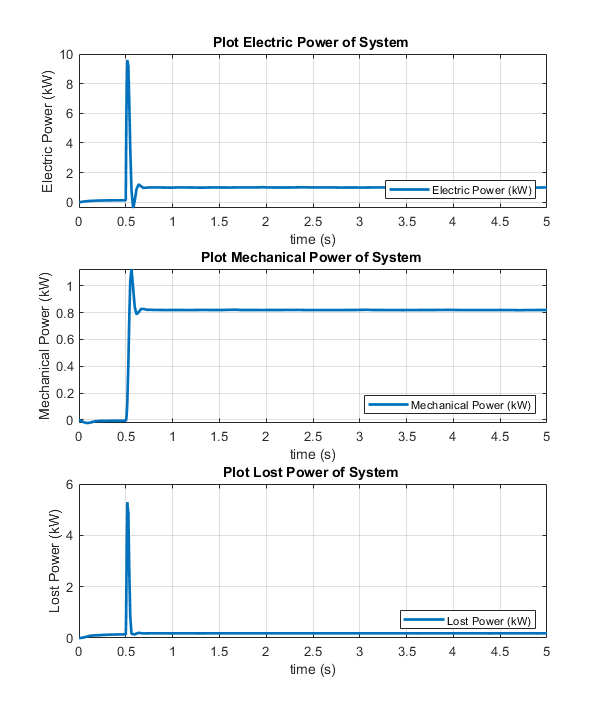

# Seperately Excited DC Motor: Sequential Step start

## Objective: 

In last [experimentaion](https://github.com/VishalDevnale/ControlSystem/tree/master/ElectricMachines/DC_Motors/01_SeperatelyExcitedDCMotor/01_AbruptStart), we noticed energy lost is high for startup.
Here we are trying differnet startup mechanisim. Rotor is winding is energized after stator, NOT at the same time like previous experiment.

NOTE: Same concept is applicable to shunt DC motor: Refer to image:

Add snap here.

Simulate a sequential start-up with no series field excitation. This means that the “shunt” field winding is connected to rated voltage, then after a short waiting interval, the armature is connected to rated voltage. 

* What waiting interval do you recommend? 
* How much energy is lost taking this to steady state?

## Model/Developement:

Simulink model is same as previous experiment (01_AbruptStart) except the way Vf and Va supplied to motor. It's implementaion is shown below.  

## Results:

* **Steady State Values**

* **Max values**

* **Torque**

* **Energy**

* **Power**

## Learnings/Comments/Analysis/Remember:
1. Less energy is consumed in startup phase than earlier experiment. Settling time = 0.73 sec. Energy spent during startup: ~ 242 J.
Which is significantly less than abrupt startup (01_AbruptStart) at 1015.82 J. It would be useful to find the optimal startup-sequence
that minimizes energy loss.

I have delayed armature energizitaion by 0.5 seconds which helped me to reduce the energy required for startup.
But, note that settling time of system is increased slightly. i.e. 0.73 sec from 0.7 sec. In next experiment we will focus on reducing settling time and startup energy both at the same time.  

You can try different delat timing for armature energazation and plot energy required for startup against that delay. Choose proper delay time. Energy required will be constant after perticular delay time which i s0.5 sec in this case. Refer following graph: 

I recommend to open [01_AbruptStart](https://github.com/VishalDevnale/ControlSystem/tree/master/ElectricMachines/DC_Motors/01_SeperatelyExcitedDCMotor/01_AbruptStart) in other tab and compare all graphs and results. You will be surprised by comparing the results.

## Future work:
I tried reducing energy spent for startup of motor in next sections (i.e. [ramp startup](https://github.com/VishalDevnale/ControlSystem/tree/master/ElectricMachines/DC_Motors/01_SeperatelyExcitedDCMotor/03_RampStart) ).
