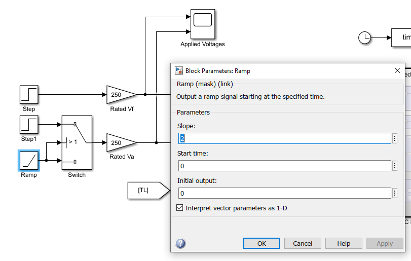
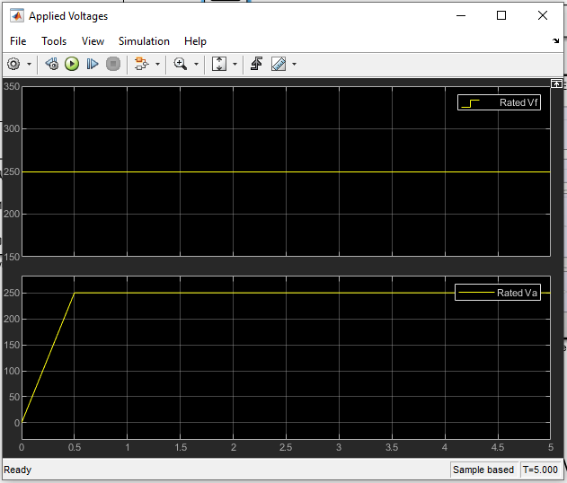
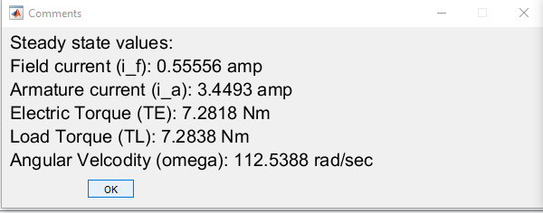
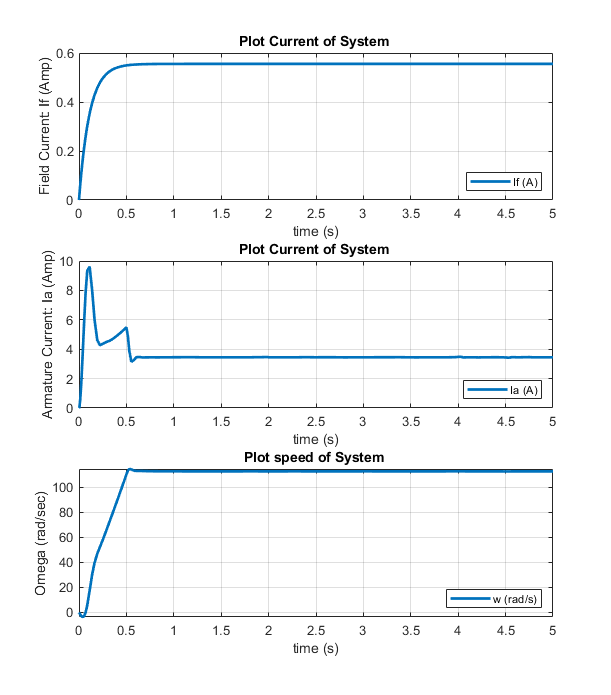
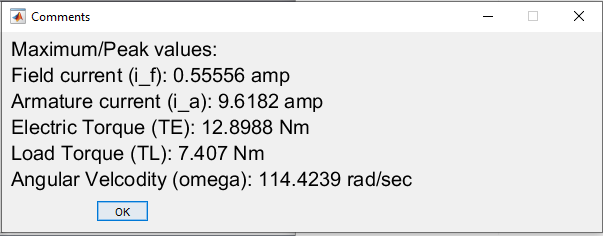
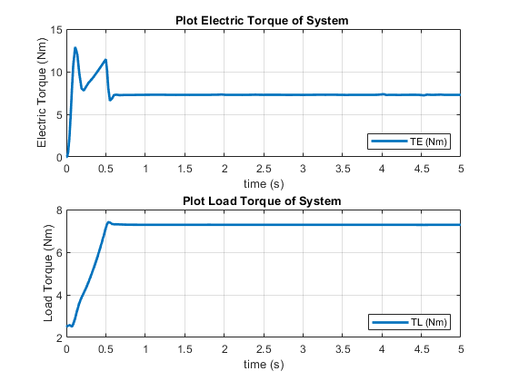
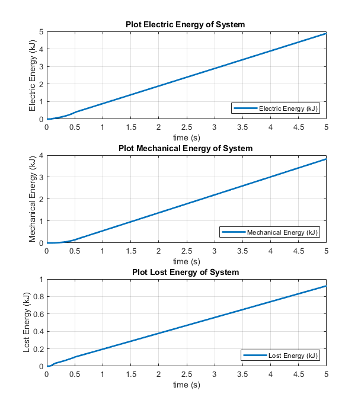
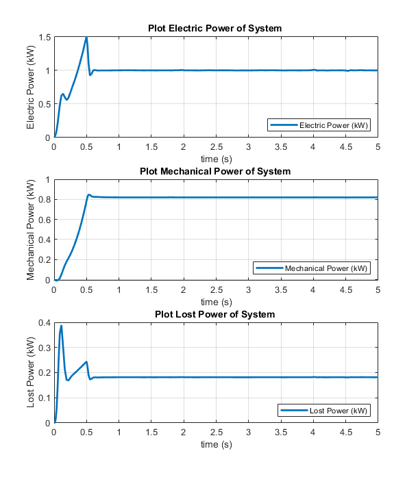

# Seperately Excited DC Motor: Ramp Start

## Objective: 

In 1st [experiment](https://github.com/VishalDevnale/ControlSystem/tree/master/ElectricMachines/DC_Motors/01_SeperatelyExcitedDCMotor/01_AbruptStart), we noticed energy lost is high for startup.

In 2nd [experiment](https://github.com/VishalDevnale/ControlSystem/tree/master/ElectricMachines/DC_Motors/01_SeperatelyExcitedDCMotor/02_SequentialStepStart), we noticed energy lost is less compared to 1st experiment.

Simulate a controlled voltage start, in which the voltages can be ramped or otherwise adjusted between 0 and 100% of rated voltage, independently on the two windings. 

**Propose a sequence to reduce starting energy losses.**

Here we are trying differnet startup mechanisim. Rotor is winding is energized at the same time as stator but NOT with the rated voltage. We will apply ramp voltage to armature.

## Model/Developement:

Simulink model is same as previous experiments (01_AbruptStart or 02_SequentialStart) except the way Vf and Va supplied to motor. It's implementaion is shown below.

You can try different ramp slopes by changing value as shown in below images:

## Results:

* **Steady State Values**

* **Max values**

* **Torque**

* **Energy**

* **Power**

## Learnings/Comments/Analysis/Remember:
1. Less energy is consumed in startup phase than earlier experiments. Settling time = 0.6 sec. Energy spent during startup: ~ 120 J.
Which is significantly less than abrupt startup (01_AbruptStart) at 1015.82 J and sequential startup 242 J. It would be useful to find the optimal startup-sequence
that minimizes energy loss.

Here settling time i.e 6 sec is also less compared to abrupt startup (01_AbruptStart) at 0.7 sec and sequential startup (0.2_SequentialStepStart) 0.73 sec.

You can try different slope to optimize settling time and startup-sequence. 

I recommend to open [01_AbruptStart](https://github.com/VishalDevnale/ControlSystem/tree/master/ElectricMachines/DC_Motors/01_SeperatelyExcitedDCMotor/01_AbruptStart) and [02_SequentialStepStart](https://github.com/VishalDevnale/ControlSystem/tree/master/ElectricMachines/DC_Motors/01_SeperatelyExcitedDCMotor/02_SequentialStepStart) in other tab and compare all graphs and results. You will be surprised by comparing the results.

## Future work:
Here we conclude the startup sequence for DC motor and now will start control:
1. [Torque Control](https://github.com/VishalDevnale/ControlSystem/tree/master/ElectricMachines/DC_Motors/01_SeperatelyExcitedDCMotor/04_TorqueControl)
2. [Position Control](https://github.com/VishalDevnale/ControlSystem/tree/master/ElectricMachines/DC_Motors/01_SeperatelyExcitedDCMotor/05_PositionControl)
