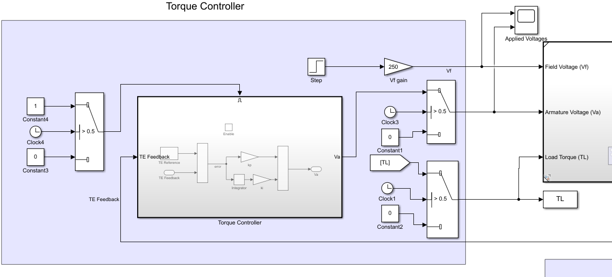

# Seperately Excited DC Motor: Ramp Start

## Objective: 

Simulate a “controlled torque” start, in which the field winding is connected to rated voltage, then after a waiting interval, the machine uses a **PI controller** to deliver the **same torque as its final steady-state value**. 
Compare energy loss and performance in different choices of controller gains.

We will use steady state torque value found in 1st [experiment](https://github.com/VishalDevnale/ControlSystem/tree/master/ElectricMachines/DC_Motors/01_SeperatelyExcitedDCMotor/01_AbruptStart), i.e. TL = 7.28369 Nm 

## Model/Developement:

Simulink model is same as previous experiment [02_SequentialStepStart](https://github.com/VishalDevnale/ControlSystem/tree/master/ElectricMachines/DC_Motors/01_SeperatelyExcitedDCMotor/02_SequentialStepStart) except that Va is supplied uisng PI controller to do torque controlled start-up. It's implementaion is shown below.

**Start-up sequence:**

1. Connect field winding to rated voltage. i.e. Vf = 250 V.

2. Wait for ‘Waiting Interval’. (this waiting interval is decided according to observations)

3. Use PI controller to deliver the same torque as it’s final steady-state value. i.e. TE = 7.28369

In control design, error = TEref- TE; Va = kp*(error)+ ki*sum(error).

You can try different values of PI gains by changing value as shown in below images:

Va for the gain shown in above image: 

## Results:

* **Steady State Values**

* **Max values**

* **Torque**

* **Energy**

* **Power**

## Learnings/Comments/Analysis/Remember:
Observation:
1. When Vf is applied to rated voltage it takes 0.5 sec to reach if to steady state value. Please refer the Vf and If plot.

2. For Kp= 100, Ki=400, Time to achieve steady state = 2.7 sec
Energy Loss = 439.268 W

3. For Kp= 100, Ki=800, Time to achieve steady state = 2.3 sec
Energy Loss = 370.013 W.

Approximate steady state value of TE is achieved quickly but then very small gradual change is observed to achieve steady state value.
No significant overshoot or undershoot is observed.
This can be considered as good calibration as time to stabilize is less and energy losses are also less.

4. For Kp= 50, Ki=50, Time to achieve steady state = 7.6 sec
Energy Loss = 1284 W.
TE shoots to 7 Nm instantly and then get undershoot-ed and then gradually increase to achieve
steady state value.

5. For Kp= 10, Ki=100, Time to achieve steady state = 4 sec
Energy Loss = 656.141 W.
No Overshoot. TE Gradually increasing to achieve steady state value.
Instant TE achieved is 6 Nm.
From Observation 3 and 4, we can conclude that kp is driving the initial increase in TE.

6. For Kp= 1, Ki=100, Time to achieve steady state is greater than 15 sec.
Energy Loss is greater than 2500W.
Very slow transition to achieve steady state TE. From this observation we can conclude that
smaller value of Kp causes larger time to stabilize and makes system slow.

## Future work:
Similarly, you can use PI control for different control tasks e.g. [Position Control](https://github.com/VishalDevnale/ControlSystem/tree/master/ElectricMachines/DC_Motors/01_SeperatelyExcitedDCMotor/05_PositionControl)
