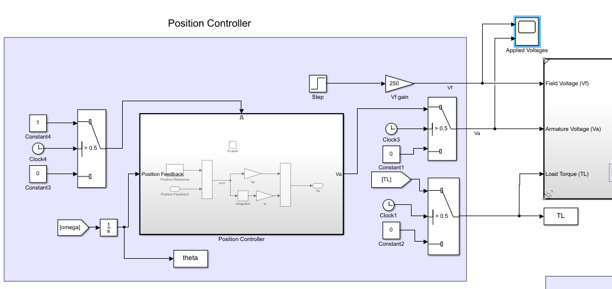
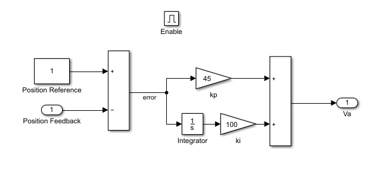
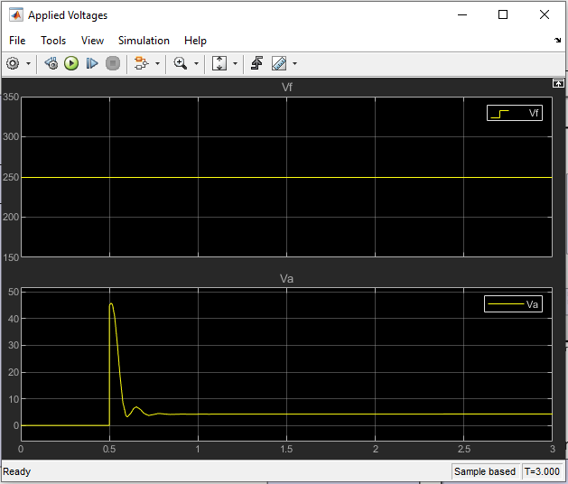
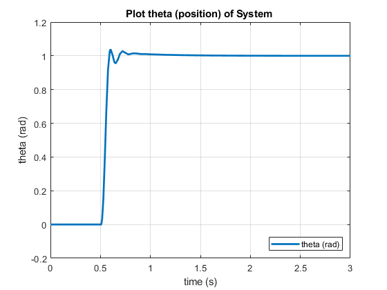
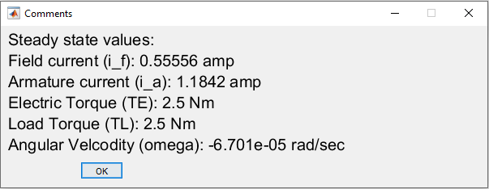
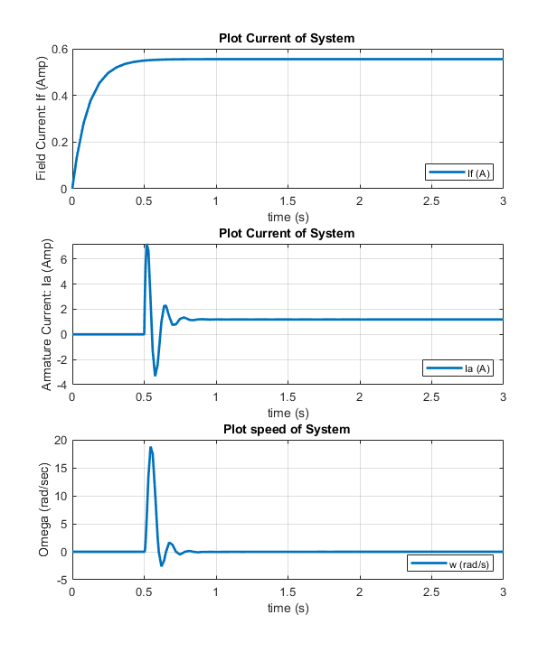
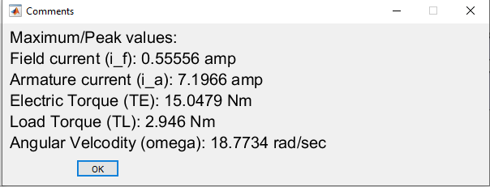
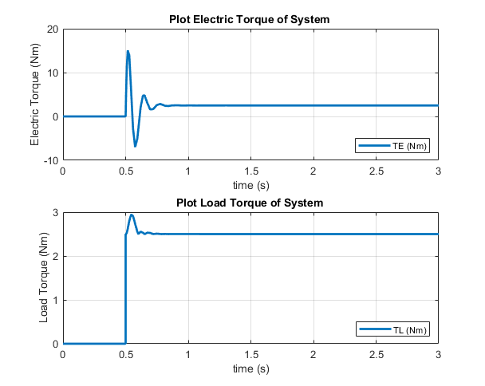
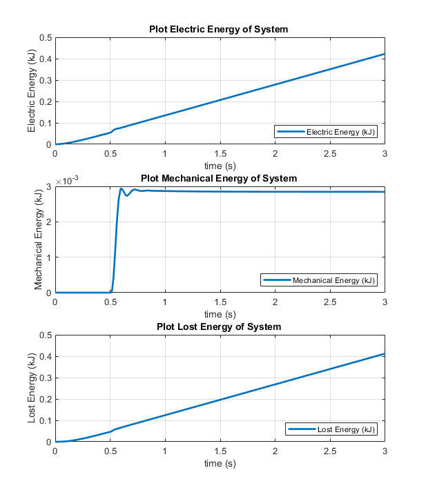
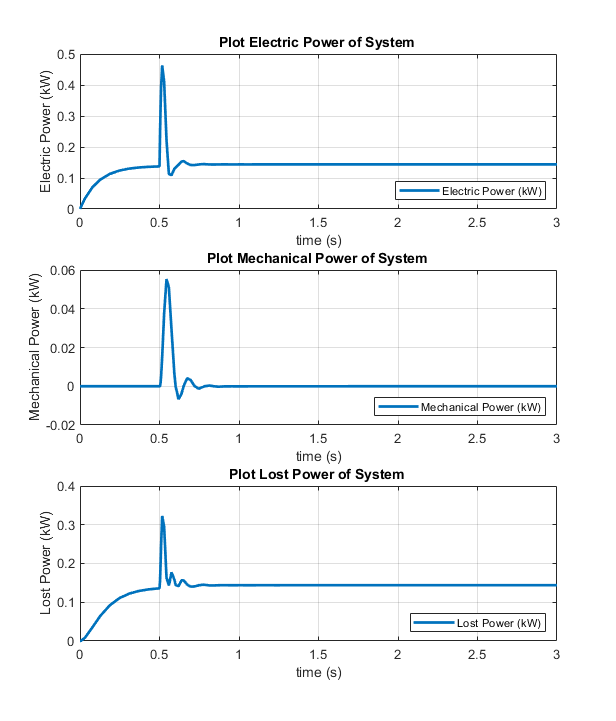

# Seperately Excited DC Motor: Ramp Start

## Objective: 

We wish to operate the machine with a position control, starting from an initial position of zero. The objective is to drive the shaft position to 1 rad and hold it there. Propose and simulate an approach to accomplish this (suggested alternatives could involve proportional-integral control based on position feedback, or some similar method). Assume an accurate position sensor is in place.

## Model/Developement:

Simulink model is same as previous experiment [02_SequentialStepStart](https://github.com/VishalDevnale/ControlSystem/tree/master/ElectricMachines/DC_Motors/01_SeperatelyExcitedDCMotor/02_SequentialStepStart) except that Va is supplied uisng PI controller to do position control. It's implementaion is shown below.

**Start-up sequence:**

To understand the position control of motor using PI, I have followed following motor startup steps:

1. Apply step Vf and Va=0, Ia= 0. i.e Rotor windings are open circuit.

2. Wait till If is stabilized to it’s stead state value. In this question it’s observed as 0.5 sec.

3. Apply Va = kp*(error)+ ki*sum(error); error = ThetaRef - Theta;

Parameters that needs to be consider to measure overall performance of the system:
* Time to stabilize the system
* Time to stabilize the parameter in control i.e Postion (θ)
* Oscillations
* Energy lost to achieve steady state/desired state

You can try different values of PI gains by changing value as shown in below images:

Va for the gain shown in above image: 

## Results:

* **Position (rad)**

* **Steady State Values**

* **Max values**

* **Torque**

* **Energy**

* **Power**

## Learnings/Comments/Analysis/Remember:

**Test 1:**

For kp = 90, ki = 200, All system parameters are getting stabilized at 1.6 sec with allowed tolerance for θ is ±0.01 rad. 
Energy lost for this stabilization is 284.278 W. θ oscillate around 1 rad, maximum overshoot and undershoot observed is 0.4 rad. Ia goes negative. 
This can be categorised as not well tuned system as overshoot value has 50% of desired angle.

**Test 2:**

For kp = 45, ki = 100, All system parameters are getting stabilized at 1 sec with allowed tolerance for θ
is ±0.01 rad. Energy lost for this stabilization is 124.507 W. Ia goes negative for these control parameters
i.e. small regen.

**Test 3:**

For kp = 22.5, ki = 50, All system parameters are getting stabilized at 1.6 sec with allowed tolerance
for θ is ±0.01 rad. Energy lost for this stabilization is 205.789 W. But θ don’t oscillate around 1rad, a
small overshoot of 0.05 rad is observed and then θ is smoothly reduced to achieve 1 rad. Ia remains
+ve.

**Test 4:**

For kp = 45, ki = 1100, All system parameters are getting stabilized at 1.2 sec with allowed tolerance
for θ is ±0.01 rad. Energy lost for this stabilization is 171.904 W. θ oscillate around 1 rad, maximum
overshoot observed is 0.7 rad. Ia goes negative. This can be categorised as not well tuned system as
overshoot value has 70% of desired angle.

**Test 5:**

For kp = 45, ki = 10, All system parameters are getting stabilized at 11 sec with allowed accuracy for θ
is -0.01 rad. Energy lost for this stabilization is 1563 W. Value of θ never goes beyond θref.

## Discussion

* Time of stabilization, overshoot-undershoot, and energy lost can be reduced by choosing well calibrated kp and Ki
