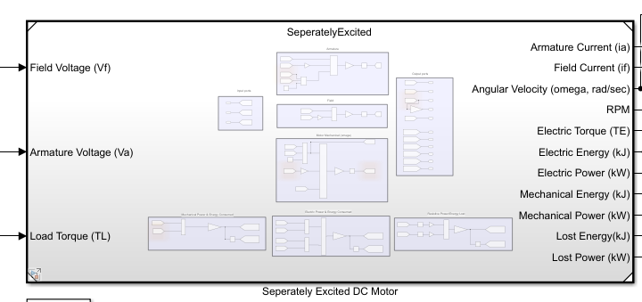
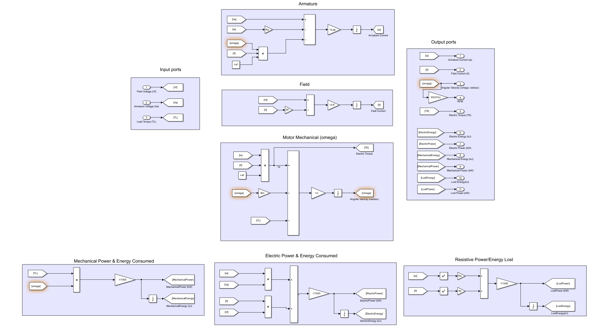

# Seperately Excited DC Motor

## Objective:

1. Implement Seperately Excited DC Motor [Simulink model](https://github.com/VishalDevnale/ControlSystem/blob/master/ElectricMachines/DC_Motors/01_SeperatelyExcitedDCMotor/01_AbruptStart/SeperatelyExcited.slx)
2. Analyse different methodologies to start the seperately excited DC motor.

   * Anyalysing factors: Energy lost, settling time, current ratings. 
   * Methods explored:
   
      *  [Abrupt Start](https://github.com/VishalDevnale/ControlSystem/tree/master/ElectricMachines/DC_Motors/01_SeperatelyExcitedDCMotor/01_AbruptStart): Simulate an abrupt startup (i.e.both (stator and rotor) windings driven immediately to rated voltage).
      *  [Sequential step Start](https://github.com/VishalDevnale/ControlSystem/tree/master/ElectricMachines/DC_Motors/01_SeperatelyExcitedDCMotor/02_SequentialStepStart): Stator is energised first and once field is created armature is connected to rated voltage.
      *  [Ramp Start](https://github.com/VishalDevnale/ControlSystem/tree/master/ElectricMachines/DC_Motors/01_SeperatelyExcitedDCMotor/03_RampStart): Simulate a controlled voltage start, in which the voltages can be ramped or otherwise adjusted between 0 and 100% of rated voltage, independently on the two windings. Propose a sequence to reduce starting energy losses. 

3. Design and implement [Torque control](https://github.com/VishalDevnale/ControlSystem/tree/master/ElectricMachines/DC_Motors/01_SeperatelyExcitedDCMotor/04_TorqueControl) using PI controller
4. Design and implement [Position control](https://github.com/VishalDevnale/ControlSystem/tree/master/ElectricMachines/DC_Motors/01_SeperatelyExcitedDCMotor/05_PositionControl) uisng PI controller

Motor RPM can be controlled similar to torque control and position control using PID cpntroller. **Motor speed controller** is designed with different (but equivalent) way of modling electric motor i.e.** Transfer Function** here: **TBD** 

## Model/Developement:

## Results:
Model is developed succesully and different startup sequence is examined. Also PID control is explored for torque and position control of motor. Position control is required for servo motors.

## Learnings/Comments/Analysis/Remember:

* If stator and rotor driven at the same time then startup loss is high whereas if we start stator and rotor is driven by ramp voltage application then energy loss is less.
* Simulation of plant model and motor together can help to choose motor according to it's capability and performance. 
