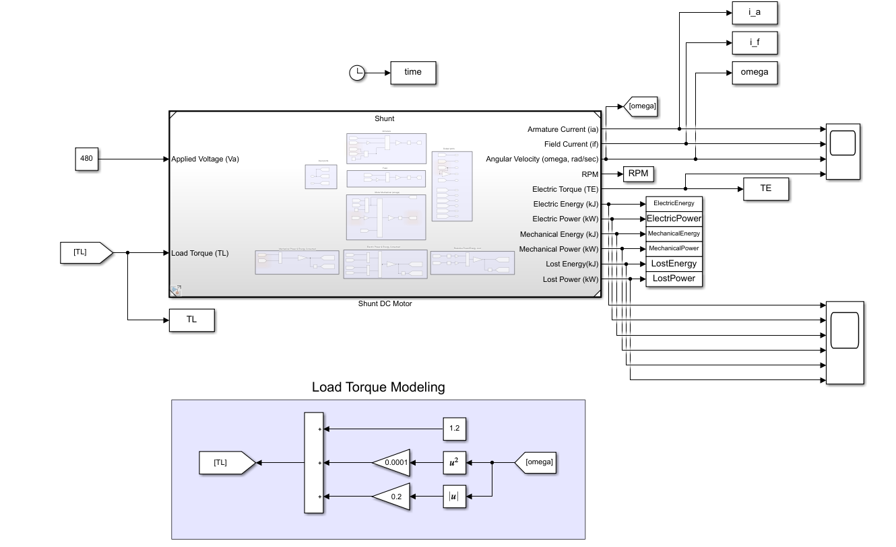
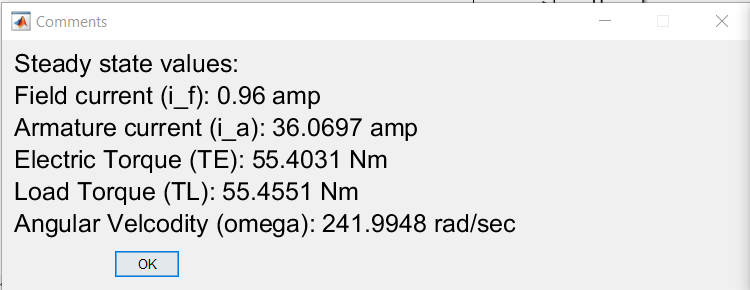
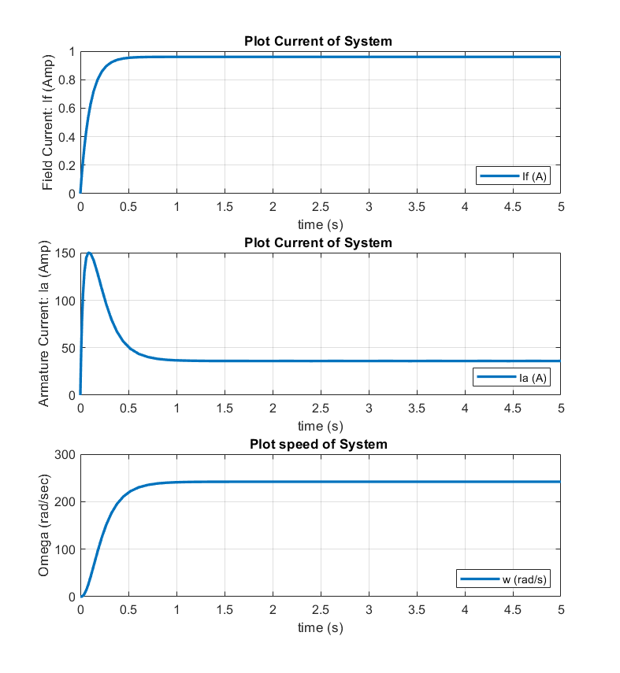
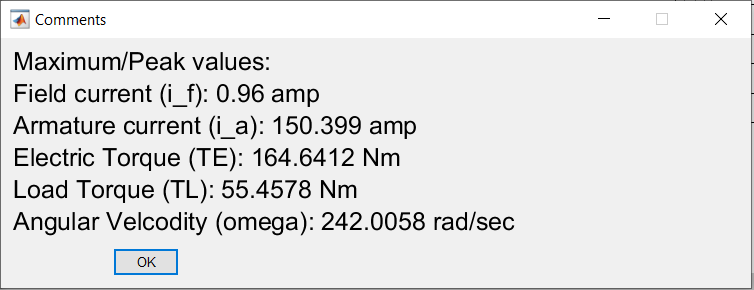
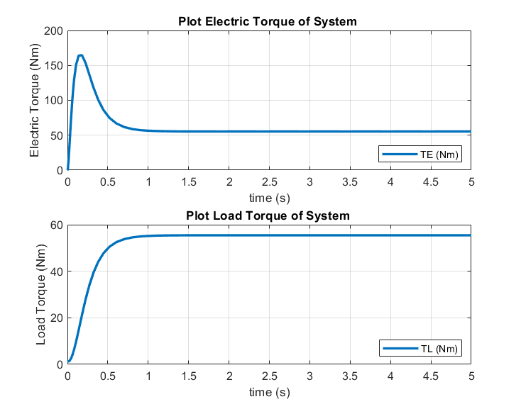
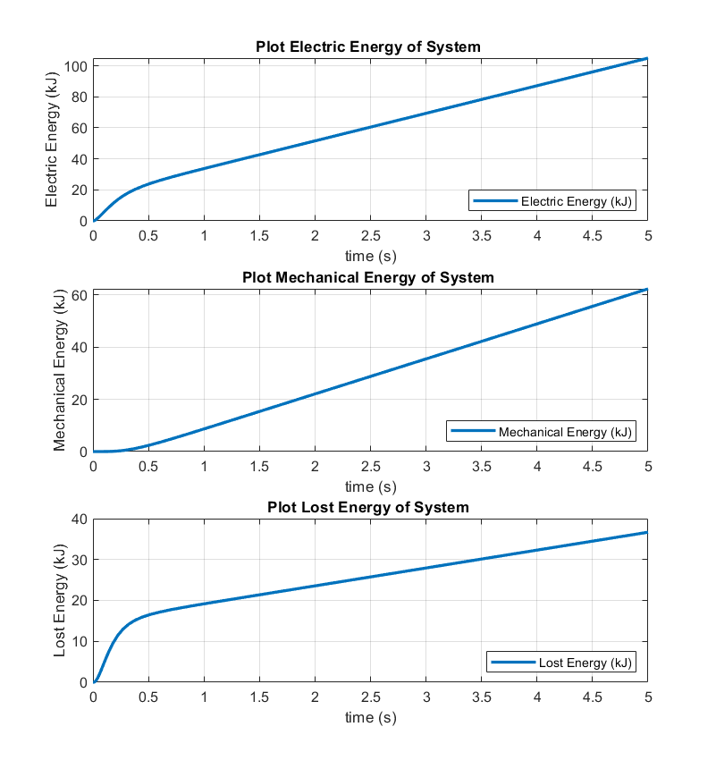
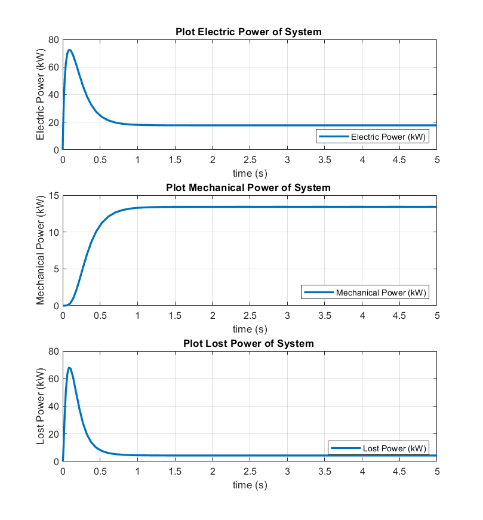

# Shunt DC Motor : Abrupt/Step Start

## Objective: 

* Simulate an abrupt/step startup (i.e.both (stator and rotor) windings driven immediately to rated voltage).
* Estimate steady state values of motor for specific applied vlotage.
* Lost power/energy anlysis.

## Model/Developement:

## Results:

* **Steady State Values**

* **Max values**

* **Torque**

* **Energy**

* **Power**

## Learnings/Comments/Analysis/Remember:
1. Steadt state analysis performed for Va = 480.
2. More energy is consumed in startup phase. Settling time = 1 sec. Energy spent during startup: ~ 18 kJ.
3. This motor startup method shows a large overshoot in armature current during the slow flux buildup.
4. For light loads, a speed overshoot is also possible.
5. Max armature current 150 Amp.

## Future work:
I tried reducing energy spent for startup of motor in next sections [ramp startup](https://github.com/VishalDevnale/ControlSystem/tree/master/ElectricMachines/DC_Motors/01_ShuntDCMotor/02_RampStart).
