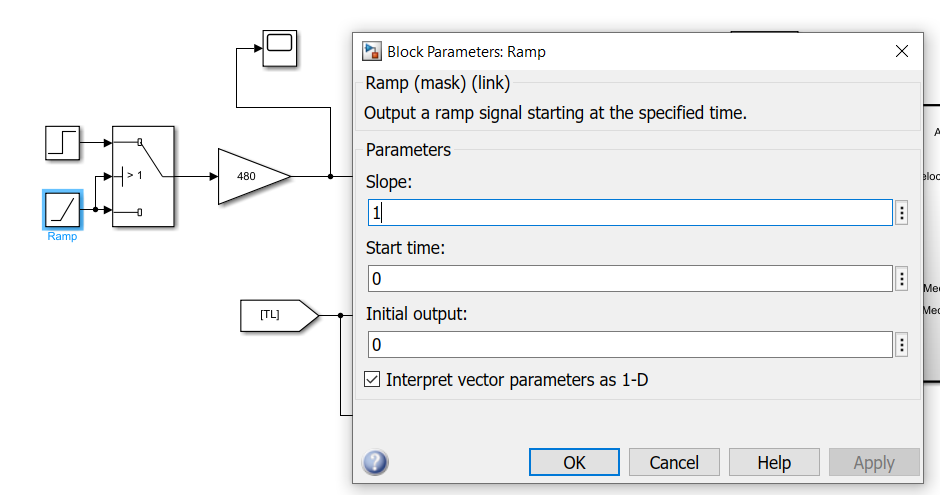
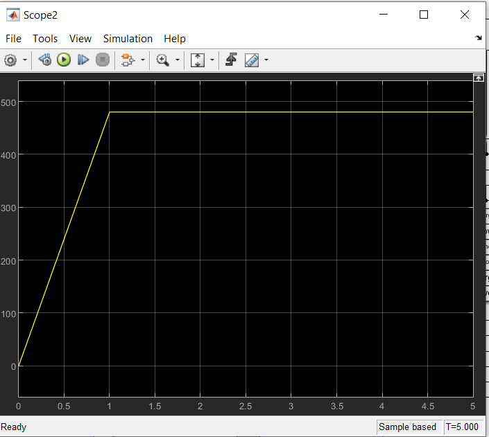
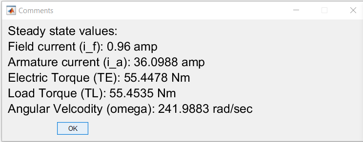
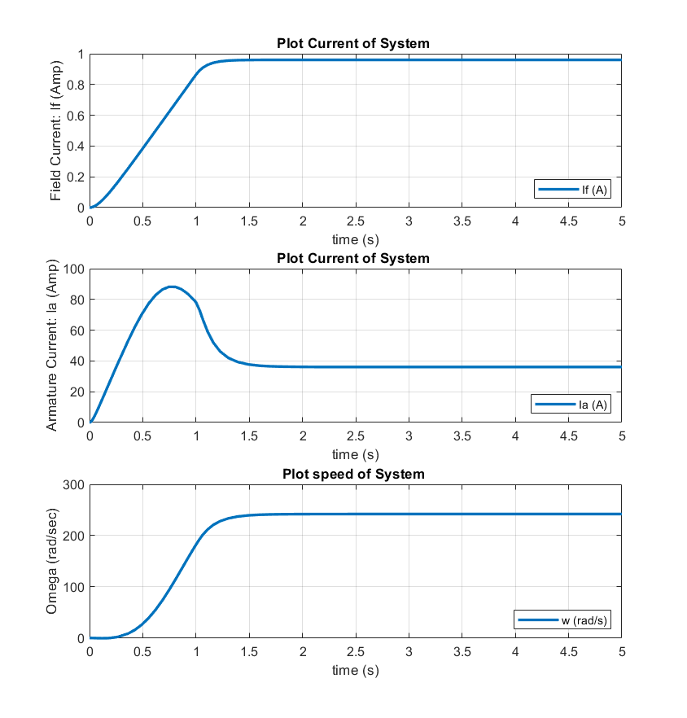
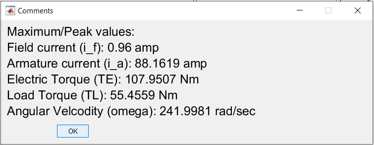
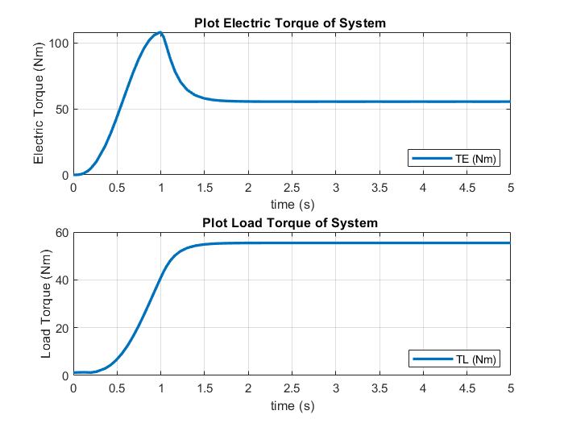
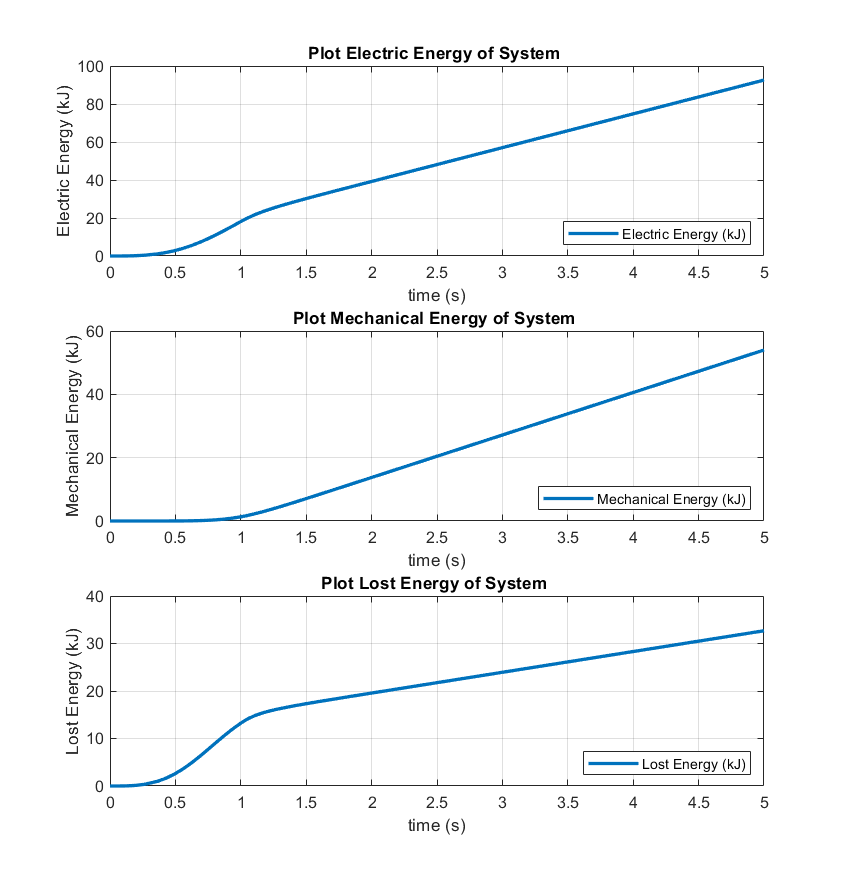
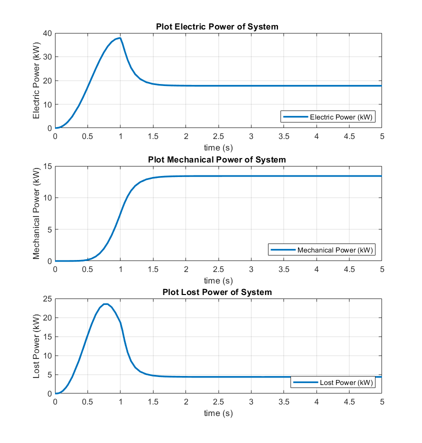

# Seperately Excited DC Motor: Ramp Start

## Objective: 

In 1st [experiment](https://github.com/VishalDevnale/ControlSystem/tree/master/ElectricMachines/DC_Motors/02_ShuntDCMotor/01_StepStart), we noticed energy lost is high for startup.

Simulate a controlled voltage start, in which the voltages can be ramped or otherwise adjusted between 0 and 100% of rated voltage.

**Propose a sequence to reduce starting energy losses.**

Here we are trying differnet startup mechanisim. We will apply ramp voltage on both armature and field.

## Model/Developement:

Simulink model is same as previous experiments (01_SteptStart) except the way voltage is applied to motor armature and field windings. It's implementaion is shown below.

You can try different ramp slopes by changing value as shown in below images:

## Results:

* **Steady State Values**

* **Max values**

* **Torque**

* **Energy**

* **Power**

## Learnings/Comments/Analysis/Remember:
1. Less energy is consumed in startup phase than earlier experiments. Settling time = 1.5 sec. Energy spent during startup: ~ 17.29 kJ.
It would be useful to find the optimal startup-sequence that minimizes energy loss.

Here settling time i.e 1.5 sec is more compared to abrupt/step startup (01_SteptStart) at 1 sec.

You can try different slope to optimize settling time and startup-sequence. 

I recommend to open [01_StepStart](https://github.com/VishalDevnale/ControlSystem/tree/master/ElectricMachines/DC_Motors/01_SeperatelyExcitedDCMotor/01_AbruptStart) and [02_SequentialStepStart](https://github.com/VishalDevnale/ControlSystem/tree/master/ElectricMachines/DC_Motors/02_ShuntDCMotor/01_StepStart) in other tab and compare all graphs and results.

## Future work:
Here we conclude the startup sequence for shunt DC motor.