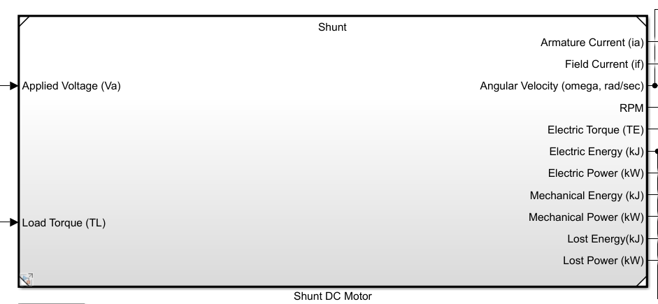
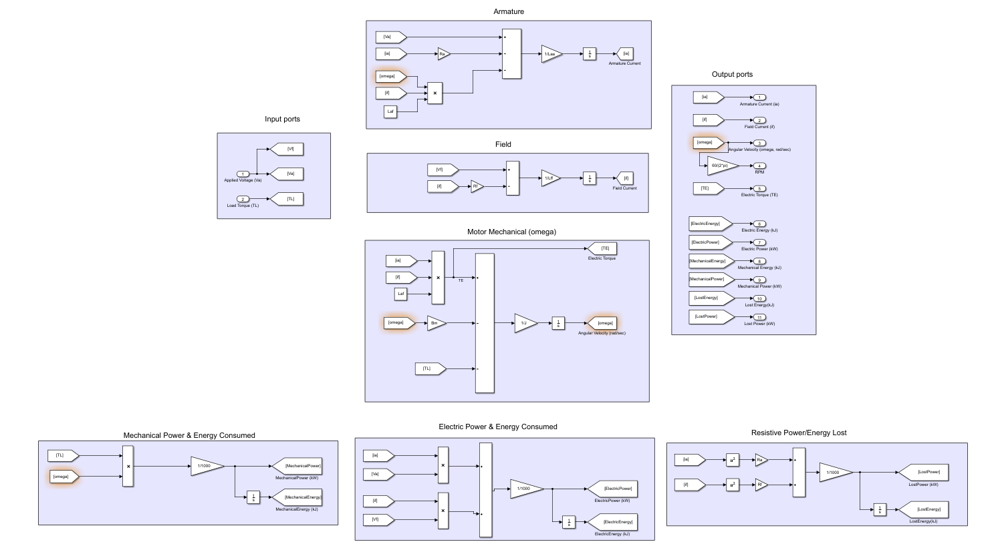

# Shunt DC Motor

## Objective:

1. Implement shunt DC Motor [Simulink model](https://github.com/VishalDevnale/ControlSystem/blob/master/ElectricMachines/DC_Motors/02_ShuntDCMotor/01_StepStart/SeperatelyExcited.slx)
2. Analyse different methodologies to start the Shunt DC motor.

   * Anyalysing factors: Energy lost, settling time, current ratings. 
   * Methods explored:
   
      *  [Abrupt/step Start](https://github.com/VishalDevnale/ControlSystem/tree/master/ElectricMachines/DC_Motors/02_ShuntDCMotor/01_StepStart): Simulate an abrupt startup (i.e.both (stator and rotor) windings driven immediately to rated voltage).
      *  [Ramp Start](https://github.com/VishalDevnale/ControlSystem/tree/master/ElectricMachines/DC_Motors/02_ShuntDCMotor/02_RampStart): Simulate a controlled voltage start, in which the voltages can be ramped or otherwise adjusted between 0 and 100% of rated voltage. Propose a sequence to reduce starting energy losses. 

## Model/Developement:

Model is very similar to seperately excited DC machine except Va = Vf.

## Results:
Model is developed succesully and different startup sequence is examined.

## Learnings/Comments/Analysis/Remember:

* If Va is ramp voltage then settling time increses but energy loss is less.
* Simulation of plant model and motor together can help to choose motor according to it's capability and performance. 
